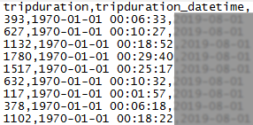
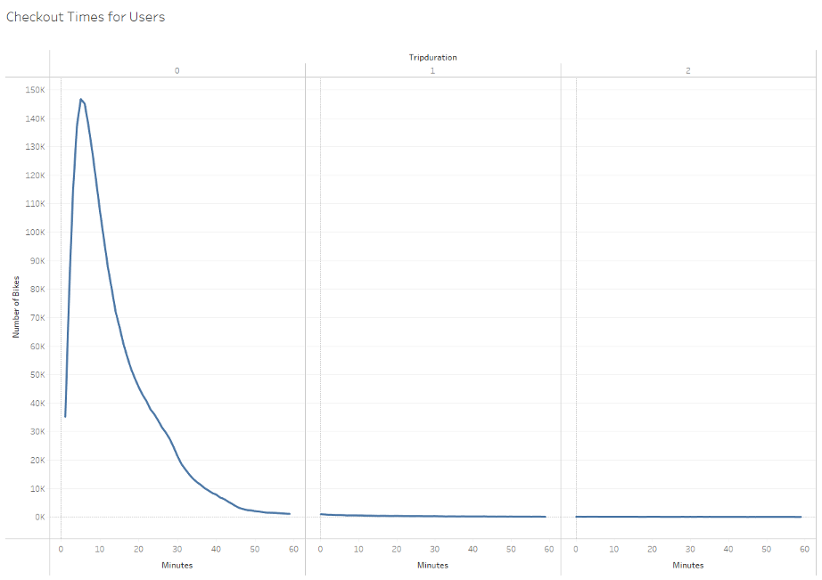
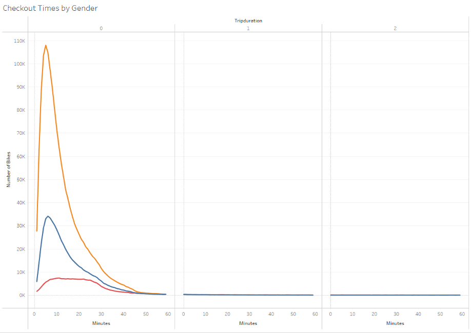
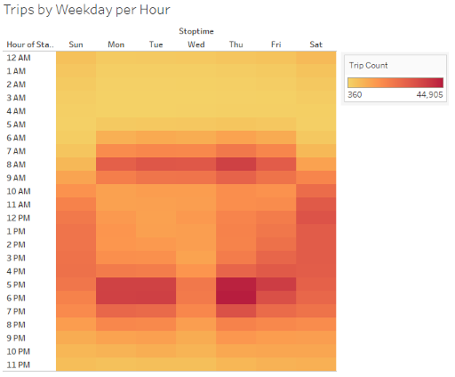
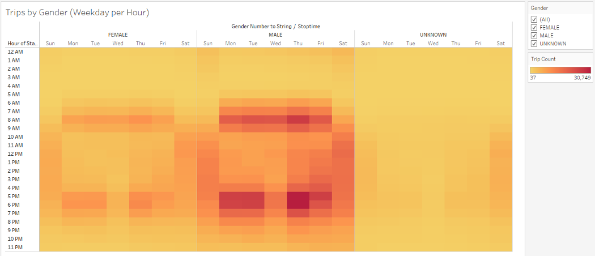
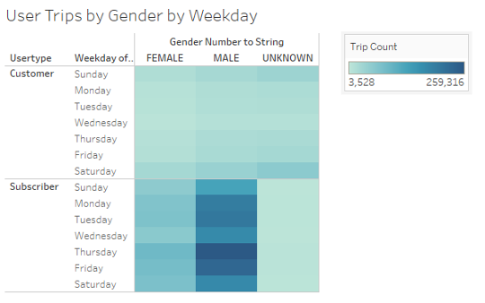
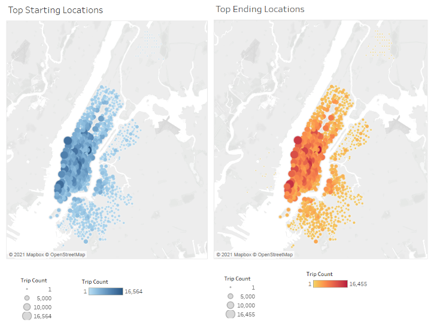
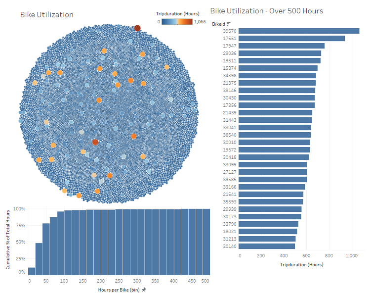

# Module 14 Challenge - Bikesharing - Tableau

## Overview

### Purpose

The purpose of this project is to visualize bikesharing data from
New York City using Tableau.

## Deliverables

### Deliverable 1

Change Trip Duration to a Datetime Format

See `NYC_CitiBike_Challenge.ipynb` and `Images/201908-citibike-tripdata_DATETIME_sample.png`

A Screenshot of a Sample of the Datetime converted datafile is shown here in Figure 2:

**Figure 2: Sample of `201908-citibike-tripdata_DATETIME_sample.png` Highlighting the First Column in hours, minutes, seconds (HH:mm:ss)**

## Results

Below is a gallery of the visualizations generated in the Tableau Public Visualization Story, along with a brief description of each below the figure.

**Figure 3: Visualization 1**

This figure shows a graphical representation of the most common Trip Durations, quantified by the number of bikes rented versus how long they were rented for, for all user types, and all user genders.

**Figure 4: Visualization 2**

This figure shows a graphical representation of the most common Trip Durations, but broken out to show the commonalities and differences in rental behavior between reported gender of system users.

**Figure 5: Visualization 3**

This figure shows when bikes are being rented more frequently and less frequently, according to Time of Day and Day of the Week.

**Figure 6: Visualization 4**

This figure shows when bikes are being rented more frequently and less frequently, according to Time of Day and Day of the Week, broken down by reported gender of system users.

**Figure 7: Visualization 5**

This figure shows when bikes are being rented more frequently and less frequently, by day of the week, broken down according to reported gender of system users, and whether the user
is a non-subscribing customer or a regular subscriber.

**Figure 8: Visualization 6**

This figure shows where bikes are most commonly being picked up by users, and dropped off by users.

**Figure 9: Visualization 7**

This composite chart shows bike utilization across the system, in a few different ways, side-by-side. The packed bubble chart shows all bikes, with cumulative Hours of Utilization
for the Month of August mapped both to the area of the bubbles, and to the color gradient. As can be seen visually, most bikes are relatively evenly distributed with an overall
low level of utilization, while a handful of them have outsized utilization numbers. The 30 bikes with over 500 Hours of Utilization are highlighted on the right hand side of the chart,
while a cumulative percentage plot of utilization is shown at the bottom. This quantifies the intuitive visual interpretation of the packed bubble chart that 97% of bikes have
100 Hours or less of utilization in the month of August.

## Summary

This analysis has been a high-level overview of a Month-long snapshot of the New York City Citi Bike Bikesharing System from the recent past of August 2019.
We have shown where bikes are most commonly picked up and dropped off, when they are being used, by whom, how often, and for how long. As part of the analysis,
the source data was examined as well for areas of inconsistency and reliability. In the main, the source data has been consistent and reliable, with the notable
exception of the Birth Year Problems discussed above.

Utilization appears to be similar between the sexes, with more overall usage by Men, but when the system is used by Women it is at the same times and for similar
durations as Men. As might be expected, rush hour commute times are significantly more popular for rentals during the standard work week of Monday-Friday, while Weekend
usage sees greater usage spread out over the times between 10 AM and 5 PM. The most frequent trip taker is a Male Subscriber during the standard work week, and the
second-most frequent trip taker is a Female Subscriber during the standard work week.

The Top Starting and Ending Locations are all on the Lower West Side, and there is a small but consistent use pattern of bikes being rented in New York and dropped off in
New Jersey.

Overall, owing to the relatively large number of bikes distributed throughout the system, there is a fairly low level of overall usage per bike, per month. During the time
under analysis, there were 13,983 unique bikeid's in the system, which we are taking to correspond 1:1 to unique bicycles. Also during the time under analysis, 97% of all
trip durations were accomplished in under 100 Hours per Bike during the Month of August.

Put another way, the overall average of usage per bike in the system during the month
of August was 48 hours per bike. If the 30 bikes with usages over 500 Hours per bike are excluded from this average, the average usage per bike for all the remaining bikes is
4 hours per bike. An unanswered question at the end of this train of thought is: Are there too many bikes in the system, and are they being under-utilized? Could the system
be better served with less bikes overall, or would a reduction in bikes lead to frustration among users and a less pleasant user experience?

### Suggestions for Future Analysis - Additional Visualizations

1. The first additional set of visualizations I would undertake to gain greater insight into system use would be to create a set of small multiples of the Top Starting Locations and Top
Ending Locations Maps, one for each day of the week shown side-by-side. This would allow greater insight to how the system is being used on weekdays versus weekends, and show
how bikes may need to be moved to even out system load at given times during the week. This would also help to better allocate maintenance resources, both temporally and geographically.
2. A second set of visualizations I would create, out of simple curiosity, and to help monitor for possible system abuse, is to map the most common Starting and Ending Locations
for the longest continuous rentals, of 500 Hours or longer in Duration.

-- END --
